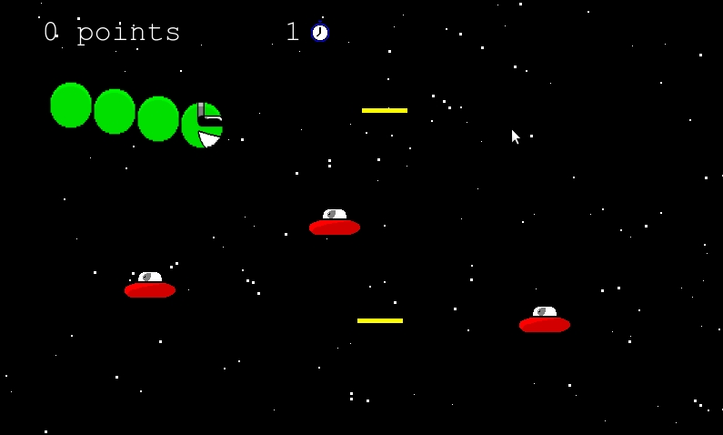

# Time Worm!

My entry for [js13kGames 2015](http://js13kgames.com/). Written using JavaScript, HTML5 canvas, and HTML5 audio.

You are the Time Worm! Your job is to destroy as many little grey men as possible. Your health is represented by the number of your body's segments, plus your head. There are no health pickups here, but if you get hit or make another mistake you can rewind time for 5 seconds and try again! Plus there's the traditional option of firing right back with your laser-firing sunglasses!

## Browser Support
* Latest Chrome
* Latest Firefox (sound not working on Debian/Ubuntu? Try installing [gstreamer1.0-libav](https://packages.debian.org/search?keywords=gstreamer1.0-libav) and then restart the browser)
* Potentially Safari (untested)

## Play Online
Check out Time Worm!'s [entry page](http://js13kgames.com/entries/time-worm) on the JS13kGames website.

## Controls
* Up - Move up
* Down - Move down
* Space - Fire
* Left - Rewind time for 5 seconds

## Credits
Everything was done by myself except for the sound effects, which are:

* [Vinyl rewind](https://freesound.org/people/TasmanianPower/sounds/162493/) by TasmanianPower
* [001.wav](https://freesound.org/people/CosmicD/sounds/33482/) by CosmicD
* [blip1.wav](https://freesound.org/people/nsstudios/sounds/321103/) by nsstudios
* [8 Bit Explosion](https://freesound.org/people/thehorriblejoke/sounds/259962/) by thehorriblejoke

All of these effects are licensed under either the Creative Commons Attribution License or the Creative Commons 0 License (public domain).

## Compression Stats for Nerds
[Compression stats](COMPRESSION.md) will be generated each time the distributable is compiled (see below).

## Running Locally
The project is dependent upon [UglifyJS](https://github.com/mishoo/UglifyJS2) and [zip](http://linux.die.net/man/1/zip) for Unix (this might be present in Cygwin or MinGW for Windows users, but I'm not certain). Clone the repository and simply run `./tasks/build.sh` to compile. A runnable version will be output to /dist, and a ZIP file will also be generated.

## Reflection
I wrote a [blog entry](http://jamesswright.co.uk/blog/1442177-time-worm-js13kgames-entry) summarising my experiences when developing this game and how I will improve going forward.
